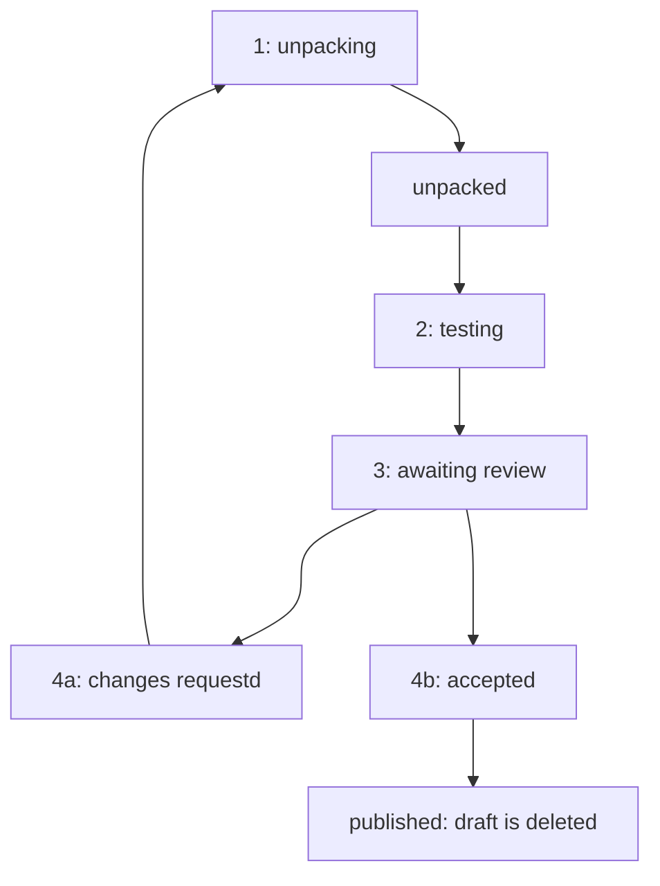

 

# collection

This repository is used to manage the resources displayed on [bioimage.io][bioimageio].

Most users will not directly dispatch the workflows defined in this reporitory, but should instead login on [bioimage.io][bioimageio] and use the front-end to interact with the bioimage.io collection.

We currently do not have a workflow for direct upload, but publicly available resource packages may be staged with a stage workflow dispatch.

## Maintaining the bioimage.io Collection

In order to update or add new resources to the [bioimage.io][bioimageio] collection, they have to undergo review.
Current reviewers are listed in [`bioimageio_collection_config.json`][review-config], under section `reviewers`.

### Reviewer Onboarding

1. Open a pull request, adding a person to the [list of reviewers][review-config], see https://github.com/bioimage-io/collection/pull/75 for an example.
   * one public email address is required
   * github id can be found using `https://api.github.com/users/<github_username>`
1. Once the pull request has been merged, the new reviewer can
   * accept resource drafts
   * request changes on resource drafts
   * upload a new version for any resource

### Review Process

The review process technically starts after a user uploaded a _resource package_.
Such a _resource package_ could e.g. be a newly uploaded _model package_, or _notebook package_, or an updated version of any existing resource.
Typically, uploaders would go via [bioimage.io/upload][upload].
Alternatively, any direct link to a downloadable resource package (`.zip`-file) would work.
The latter option is reserved for members of this repository (or the bioimageio org).

#### Staging

Now the stage workflow needs to be dispatched.
If the resource package was uploaded via the bioimage.io website, this is initiated automatically.
In case of a url to a resource package, the `stage` workflow needs to be [dispatched manually, or via github api][staging-w] ("run workflow")[^1].
Staging unpacks the files from the zipped resource package to our public S3.
Once unpacked, the staged _resource draft_ is automatically tested ([test workflow][test-wf] is triggerd automatically at the end of the stage action).

#### Testing

Staged resource drafts are automatically tested:

* Is their metadata valid?
* Can test outputs be reproduced from test inputs?
* Are linked URLs available?
* ...

Tests can also be triggered (via github api or manually) by dispatching the [test workflow][test-wf][^2].

Once the tests are completed, a reviewer needs to take a look.
The uploader gets a notification via email.
An overview of all pending _resource drafts_ can be found at https://bioimageio-uploader.netlify.app/#/status.
A _draft_ is identified by its concept id (`id` from the `rdf.yaml`).

#### Review

Reviewers should check the models for technical correctness (aided by CI, see [Testing section](#testing)) and contents/metadata of the resource.
For models, reviewers can use [the model documentation][model-docs] as a guide.

Reviewers can:

 * _request changes_:
   A contributor is expected to upload an updated (fixed) draft (which overwrites the current draft).
   This can be done either by the website, or the stage workflow.
   Important is to keep the `id` the same.
* _accept_:
  Accepting the _resource draft_ via the web interface triggers the [publish workflow][publish-wf], which creates a new unique _resource version_.
  As a result, the resource is published, the draft deleted and, thus, the _resource_ is available via the [bioimage.io][bioimageio] website.
  The [backup workflow][backup-wf] will upload/publish the _resource version_ to zenodo using the bioimage.io bot account (tagged with [`backup.bioimage.io`][zenodo-overview]). 
  

Additionally an 'error' status may be shown if an exception occured.
This also may be the case for invalid inputs.

[^1]: Parameters to this workflow are `Bioimage.io resource identifier` (`id` from the `rdf.yaml`), and `Download URL of the resource package zip-file`, which should contain a publicly reachable url to a _resource package_ `.zip`-file.
[^2]: Parameters to this workflow are `Bioimage.io resource concept` (`id` from the `rdf.yaml`), and `Published version or 'draft'` (optional, usually `draft`).

[backup-wf]: https://github.com/bioimage-io/collection/actions/workflows/backup.yaml
[bioimageio]: https://bioimage.io
[model-docs]: https://bioimage.io/docs/#/guides/developers-guide?id=model-documentation
[review-config]: https://github.com/bioimage-io/collection/blob/main/bioimageio_collection_config.json
[publish-wf]: https://github.com/bioimage-io/collection/actions/workflows/publish.yaml
[staging-wf]: https://github.com/bioimage-io/collection/actions/workflows/stage.yaml
[test-wf]: https://github.com/bioimage-io/collection/actions/workflows/test.yaml
[upload]: https://bioimage.io/#/upload
[zenodo-overview]: https://zenodo.org/search?q=metadata.subjects.subject%3A%22backup.bioimage.io%22&l=list&p=1&s=10&sort=bestmatch
